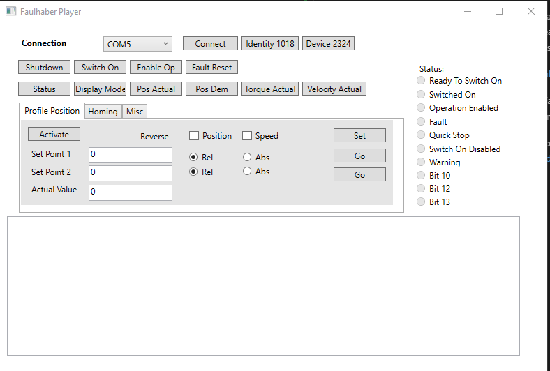

# FaulhaberLab

This was my first attempt to communicate with Faulhaber MC 5004 P motion controller via UPS/RS232 interface https://www.faulhaber.com/en/products/series/mc-5004-p/. 

From the document: the object dictionary contains parameters, set-points and actual values of the drive.  The object dicionary is the link between the application (drive functions) and the communication services.  The master communicatates with the object dictionary via the interface (USB/RS232) and using the communication services that are based on CAN-open device system.

SDO (Service Data Objects) are used to read and write information to the object dictionary.  The way it works, the software builds telegrams to read or write data from/to an object dictionary, then sends them to the interface and receives responses.

For more information see https://www.faulhaber.com/fileadmin/Import/Media/EN_7000_05052.pdf

Faulahber.Core  - communication library.
FaulhaberPlayer - GUI application to operate the motor, test motion & homing and monitor status register.
FaulhaberMonitorService - monitors motor position.

Note that Faulhaber released a library to communicate with their controllers using C++ and C# - MomanLib. https://faulhaber.com.cn/fileadmin/Import/Media/AN176_EN.pdf.  I discovered it later in the project.  
